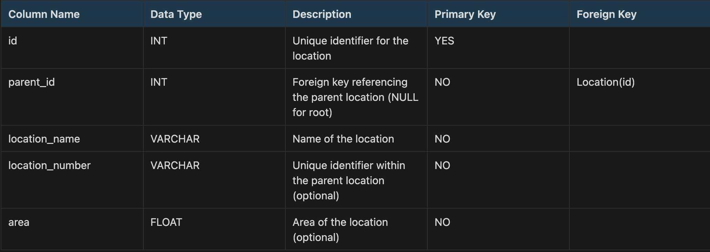

# Location Management API

This API allows users to manage locations in a hierarchical structure, enabling creation, update, and deletion of locations. The target audience for this documentation is developers who will integrate with the API.

## Table of Contents

- [I. Get Started](#i-get-started)
  - [Installation](#installation)
  - [Running the app](#running-the-app)
  - [Test](#test)
- [II. Introduction](#ii-introduction)
- [III. System Requirement](#iii-system-requirement)
  - [Business Requirement](#business-requirements)
  - [Technical Requirement](#technical-requirements)
- [IV. Database Design](#iv-database-design)
- [V. API Documentation](#v-api-documentation)

## I. Get Started

### Installation

```bash
# Install dependencies
npm install
npm start
```

### Running the app

```bash

# development

npm run start

# watch mode

npm run start:dev

# production mode

npm run start:prod

```

### Test

```bash
# unit tests
npm run test

# test coverage
npm run test:cov
```

## II. Introduction

This document outlines the functionalities and technical aspects of the Location Management API. This API allows users to manage locations in a hierarchical structure, enabling creation, update, and deletion of locations. The target audience for this documentation is developers who will integrate with the API.

## III. System requirement

### Business Requirements

- The API facilitates CRUD operations (Create, Read, Update, Delete) on locations.
- Locations are organized hierarchically, allowing for nested structures (e.g., Building -> Floor -> Room).

### Technical Requirements

- Development Stack: NestJS (Backend Framework), TypeScript (Programming Language)
- Database: PostgreSQL
- Others:
  - Validation request
  - Handle exception.
  - Implement Logging.

### IV. Database design

The API utilizes a single table in PostgreSQL named Location to represent the location hierarchy


### V. API Documentation

[Please refer to this API Documentation](https://leandevbyleon.notion.site/Coding-test-Cuong-Le-abd9dfd0603844d58cdc3e2d6dfc97ee#08c4a5e2e0cf4a2e9b4c1b21349d82d6)
